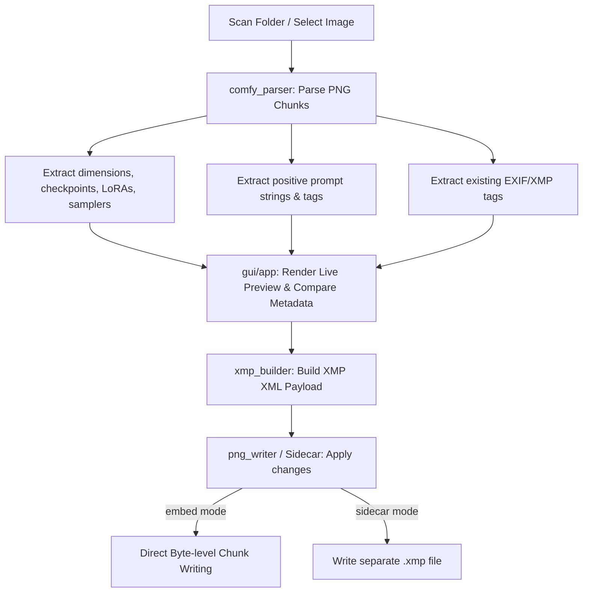

# Technical Manual & Codebase Guide
## ComfyUI XMP Tagger

This document serves as a technical manual and onboarding reference for developers and AI coding agents. It explains the system architecture, file structure, core algorithms, and unique UI/backend mechanics of the application.

---

## 1. System Overview & Architecture

The application is a standalone desktop utility written in Python using `customtkinter`. It automates the parsing of metadata from **ComfyUI-generated PNG files** and embeds it as hierarchical and flat **XMP/Dublin-Core metadata tags** compatible with image management software like **digiKam** and **Adobe Lightroom**.

---

## 2. Directory & File Map

* **`main.py`**: The application entry point. Initializes localized strings and launches the main graphical user interface.
* **`gui/`**
  * **[`gui/app.py`](file:///c:/Users/Bitcrusher/Documents/_Code/AntiGravity/PNG-ImageTagger/gui/app.py)**: Houses the entire user interface (`App` class), layout definitions (Tabs: Processing, Settings, Workflow Analyzer, Layout, Help & About), modal dialogs (ThemeEditor, CustomMetadata), listbox rendering, and QoL multi-threading.
* **`backend/`**
  * **[`backend/comfy_parser.py`](file:///c:/Users/Bitcrusher/Documents/_Code/AntiGravity/PNG-ImageTagger/backend/comfy_parser.py)**: Contains the core parsing algorithms. Extracts workflow details, prompts, image sizes, and checks for existing XMP metadata. Includes `analyze_workflow_prompts` to inspect raw PNG metadata and identify positive prompt fields dynamically.
  * **[`backend/xmp_builder.py`](file:///c:/Users/Bitcrusher/Documents/_Code/AntiGravity/PNG-ImageTagger/backend/xmp_builder.py)**: Assembles the XMP XML payload using standard namespaces (Dublin Core, Lightroom, DigiKam). Handles merging new tags with existing tags.
  * **[`backend/png_writer.py`](file:///c:/Users/Bitcrusher/Documents/_Code/AntiGravity/PNG-ImageTagger/backend/png_writer.py)**: Handles byte-level modification of PNG files to inject XMP XML metadata into the file structure without re-encoding pixels.
  * **[`backend/settings_manager.py`](file:///c:/Users/Bitcrusher/Documents/_Code/AntiGravity/PNG-ImageTagger/backend/settings_manager.py)**: Manages load/save operations for settings (`settings.json`) and named settings presets.
  * **[`backend/theme_manager.py`](file:///c:/Users/Bitcrusher/Documents/_Code/AntiGravity/PNG-ImageTagger/backend/theme_manager.py)**: Manages default color themes and user-customized styles.
  * **[`backend/localization.py`](file:///c:/Users/Bitcrusher/Documents/_Code/AntiGravity/PNG-ImageTagger/backend/localization.py)**: Handles localization (English & German) for all UI components.
* **`config/`**
  * Houses dynamic user files (e.g. `settings.json`, custom `themes.json`, text filters like `stopwords.txt`, `adjectives.txt`, `short_words.txt`, and user presets).
* **Launch Scripts**:
  * **`setup.py`**: Validates system dependencies and performs initial configuration checks.
  * **`Start.bat` & `Start.vbs`**: Simple launch options. `Start.vbs` runs the application silently in the background (preventing terminal popup).

---

## 3. Technical Core Mechanics

### 3.1. Byte-level PNG Metadata Injection (`embed` mode)
Re-encoding a PNG using libraries like Pillow decompresses and recompresses pixel data, which is slow (seconds per image) and strips out custom ComfyUI metadata chunks. 

To prevent this, [`backend/png_writer.py`](file:///c:/Users/Bitcrusher/Documents/_Code/AntiGravity/PNG-ImageTagger/backend/png_writer.py) directly edits the PNG binary stream on a chunk level:
1. Validates the 8-byte PNG signature.
2. Iterates through the file chunks (4-byte length + 4-byte type + data + 4-byte CRC).
3. If an existing `iTXt` XMP chunk is present, it strips it out.
4. Inserts a new uncompressed `iTXt` chunk containing the generated XMP XML payload right before the first `IDAT` (pixel data) chunk.
5. Recomputes CRC-32 checksums for modified/inserted chunks.
* **Result**: Execution takes ~30ms per image, is completely lossless, and preserves all other ComfyUI nodes/workflow structures.

### 3.2. ComfyUI Metadata Parsing
[`backend/comfy_parser.py`](file:///c:/Users/Bitcrusher/Documents/_Code/AntiGravity/PNG-ImageTagger/backend/comfy_parser.py) decodes two potential chunks:
* **`prompt` (API Format)**: Contains the raw computational graph. Helpful to read samplers, steps, CFG, and active models.
* **`workflow` (UI Format)**: Contains visual nodes. Helpful to check active/inactive states (muted or bypassed nodes are ignored during tag extraction).

#### Node Specific Parsers & PowerLoraLoader
Special loaders and custom nodes are parsed dynamically:
- **`Power Lora Loader (rgthree)`**: Extracted from both execution graphs (`prompt` inputs) and UI visuals (`workflow` widget values). The parser reads model and clip strength configurations, evaluates the node's activation status (`"on": true`), and filters out deactivated or bypass entries automatically.

#### Prompt Key Resolution
Prompts are extracted by looking up specific text fields (e.g. `CLIPTextEncode` nodes) using configuration keys (defined in Tab 2). If matched, strings are filtered to skip negative prompts, camera information, and bad quality lists (e.g. blurry, low quality, worst quality).

### 3.3. Windows GDI Handle Safety & Customizable Listbox Details
Standard UI wrappers in Tkinter/CustomTkinter would create individual widgets (frames, checkboxes, labels) for each file in the file list. On Windows, this runs into the strict OS **User/GDI Handle limit** (~10,000 handles), causing crashes on large folders.

[`gui/app.py`](file:///c:/Users/Bitcrusher/Documents/_Code/AntiGravity/PNG-ImageTagger/gui/app.py) solves this by using a **single `CTkTextbox`** acting as a high-performance virtual listbox:
- Visual checkboxes (`[X]` / `[ ]`) and status badges (`[XMP]`) are rendered as plain text.
- Customized text tags (`checked_box`, `unchecked_box`, `xmp_prefix`, `selected_line`) are used to colorize and style individual characters dynamically.
- Click events are captured via coordinates (`self.file_listbox.index("@x,y")`) to determine which line and column were clicked, enabling instant state toggles.

#### Column sequence & metadata warnings
- **Sequence customization**: Users can dynamically manage column sequence and visibility for Checkpoints, LoRAs, Resolution Tier, and Creation Date in the file listbox using reordering arrow buttons.
- **Sparse metadata indicators**: The listbox prepends a warning icon (`⚠️`) directly next to filenames if prompt tags are sparse/empty (under 3 tags), or if checkpoint and sampler details are missing. These warnings can be toggled via settings, and a colorized warning summary is displayed in the listbox header.

### 3.4. Threaded Directory Scanning & Cancellation
To ensure a responsive GUI, scanning directory trees and parsing ComfyUI metadata is executed on a background thread:
- **Immediate Preview Reset**: When a scan begins, the image thumbnail, metadata labels, and XMP tag previews are immediately cleared to prevent displaying obsolete data during loading.
- **Active Cancellation**: The "Scan Folder" button dynamically transitions into a red "❌ Scan abbrechen" action during execution. Clicking it sets a cancellation flag, stopping the background thread gracefully and preserving already scanned files.

### 3.5. Tokenization & Filters
Prompt text is split into tags using two modes:
* **Standard comma-separated split**: Splitting prompts by commas and cleaning weights/brackets.
* **Word-based split**: Splitting by spaces/punctuation.
  - Filters out **Stopwords** (`stopwords.txt`).
  - Ignores short words (under 3 characters) unless whitelisted (`short_words.txt`).
  - Merges **Adjectives** (`adjectives.txt`) with the following noun (e.g., `"green"` + `"nature"` -> `"green nature"`).
- **Lowercase Normalization**: If enabled, prompt tags are converted to lowercase before writing. Checkpoints/LoRAs are kept in their original casing to avoid breaking paths in tools.
- **Bypassing Confirmation dialog**: Users can optionally turn off the settings panel confirmation dialog to enable instant batch tagging execution.

### 3.6. Smart Color Previews & Comparison
When displaying the XMP live preview in the GUI, the application compares the values to be written with the image's existing metadata:
* **Existing tags and metadata**: If the value/tag is already present in the file's current XMP metadata, it is rendered in **gray** (`existing` tag style).
* **New/modified tags and metadata**: If a tag is new or different, it is highlighted in **green** (new tag) or **purple/lavender** (extra metadata like Creator, Copyright, etc.).
* **Deletion preview**: If overwrite mode is active, tags that will be discarded are highlighted in **red** (`deleted` tag style).

### 3.7. EXIF Date Extraction & Fallback
The image creation date is resolved in order of priority:
1. **EXIF Metadata**: Looks up standard EXIF tags `36867` (DateTimeOriginal), `36868` (DateTimeDigitized), and `306` (DateTime) from the PNG EXIF header.
2. **XMP Metadata**: Falls back to `xmp:CreateDate` in embedded or sidecar XMP XML files.
3. **Filesystem Fallback**: If no metadata date exists, it uses the OS filesystem creation timestamp (`os.path.getctime`).

### 3.8. Paired Sampler & Scheduler
To ensure metadata consistency, the XMP tag builder pairs sampler names with their corresponding schedulers using index-based lookup (e.g., generating `Sampler: euler / normal` or `Sampler: lcm / karras`). These paired values are saved as flat and hierarchical XMP metadata tags, matching the visual layout of the live preview panel and details overlays.

### 3.9. Workflow Analyzer & Key Injection
To simplify workflow configuration, the "Workflow Analyzer" tab enables direct inspection of a sample PNG image's ComfyUI metadata:
- **Heuristic Parsing**: Filters out paths, file endings, and negative prompt keywords to locate candidate text blocks containing positive prompts.
- **Precision Targeting**: Displays discovered candidates alongside shortcut actions to add the exact **Node ID**, **Widget Key**, or **Custom Node Title** directly into the `Custom Prompt Field Names` configuration, updating settings instantly.
- **Dynamic Visual State Feedback**: Pre-scans current settings upon loading. If a key is already present in Settings, the button is rendered in disabled mode with a green color (`#2b8a3e`) and a checkmark (`✓`). When a user clicks a button, it immediately transitions to the green disabled state without disrupting popup blockers, indicating successful injection.
- **Copy-Safe Previews**: Renders raw prompt values in select-and-copy-enabled textboxes to allow easy inspection.
- **Live Image Preview**: Displays the image thumbnail in the top-right corner of the tab to facilitate quick visual matching, with real-time size updates synchronized with the global preview scale settings.
- **Layout Grid Optimization**: Grids the thumbnail directly on the tab layout level (rowspan=2, column=1) rather than inside the top frame. This isolates the vertical stretch of the image block, allowing the scroll container to start immediately below the header frame and eliminating unnecessary empty gaps on the left.

### 3.10. Help & About Tab
Provides a structured user manual to onboard new users and explain the app's rules:
- **Tabbed Sub-navigation**: Uses a segmented button variable listener to swap localized helper panels (`getting_started`, `tagging_rules`, `shortcuts`, `about`) dynamically within a single UI frame, minimizing vertical scrolling.
- **Card Layouts**: Displays steps and explanations inside thematic containers styled with custom font variables.
- **Changelog Toplevel Modal**: Opens `CHANGELOG.md` in a read-only toplevel popup text view to provide full version history inside the app.

---

## 4. Configuration, Themes & Presets

* **Settings File**: Loaded from `config/settings.json`. Stores all custom folder settings, megapixel tiers, custom copyright strings, language settings, and active themes.
* **Preset Manager**: Users can save their current GUI parameters under named preset profiles inside `config/presets/`. Loading a preset hot-swaps all configuration variables instantly.
* **Dynamic Theme Manager**: Hot-reloads interface styling dynamically. Merges theme dictionaries (backgrounds, buttons, listbox selection, highlights) and propagates colors through the Tkinter widget tree on-the-fly. Custom presets are stored in `config/themes.json`.
